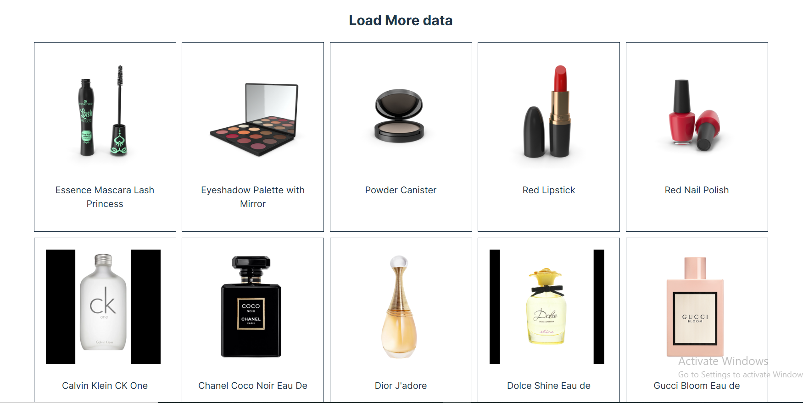
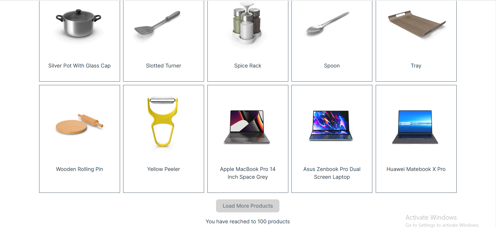

# React + Vite

This template provides a minimal setup to get React working in Vite with HMR and some ESLint rules.

Currently, two official plugins are available:

- [@vitejs/plugin-react](https://github.com/vitejs/vite-plugin-react/blob/main/packages/plugin-react/README.md) uses [Babel](https://babeljs.io/) for Fast Refresh
- [@vitejs/plugin-react-swc](https://github.com/vitejs/vite-plugin-react-swc) uses [SWC](https://swc.rs/) for Fast Refresh

# Load More Products Project

## 1. Objective
The goal of this project is to fetch products from a public API in chunks (pagination), display them on the page, and allow users to load additional products until reaching a limit of 100 items. Once the limit is reached, the "Load More" button should be disabled and visually updated to indicate no further action.

## 2. Step-by-Step Approach
### a. Initial Setup
Framework/Library: Used React.js for building the UI because of its component-based architecture and efficient state management.
Styling: Basic styles are applied using a CSS file (style.css).
### b. Fetching Data
Integrated the dummyjson API to fetch product data in batches of 20 using the limit and skip parameters for pagination.
Implemented an asynchronous function fetchProduct to make the API call and handle potential errors gracefully.
### c. Pagination Logic
Maintained a count state to track the number of pages loaded.
Used the skip parameter of the API to dynamically fetch the next set of products based on count.
### d. Managing Products State
Maintained a products state array to store all fetched products.
Filtered out duplicate products (if any) to ensure only unique items are displayed.
### e. Loading State
Added a loading state to display a message while fetching data from the API.
### f. Disabling Load More Button
Tracked the number of products fetched using the products state.
Added a disableButton state, which becomes true when 100 products are loaded.
Dynamically styled the "Load More" button to provide visual feedback when it’s disabled.
### g. Component Lifecycle
Used useEffect to:
Trigger the fetchProduct function whenever the count state changes.
Monitor the products state to disable the button once 100 products are reached.
### h. User Interface
Displayed fetched products with an image and title.
Added a "Load More Products" button that fetches and appends the next set of products when clicked.
Disabled and changed the appearance of the button after reaching 100 products, with an additional message to inform the user.

## 3. Challenges Addressed
Duplicate Products: Implemented a filtering mechanism to ensure only new products are appended to the products state.
Performance: Managed state updates efficiently to avoid unnecessary re-renders.
User Experience: Enhanced the button's usability by disabling it and updating its appearance when no more products could be loaded.
## 4. Tools and Technologies
React.js: For building the UI and managing state.
CSS: For styling the components and improving visual feedback.
JavaScript (ES6): For API calls, data filtering, and implementing logic.
Public API (dummyjson): For fetching mock product data.

## snap from project

